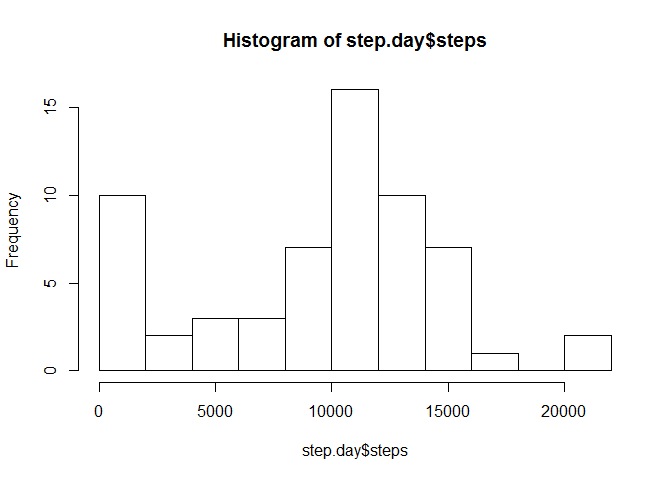
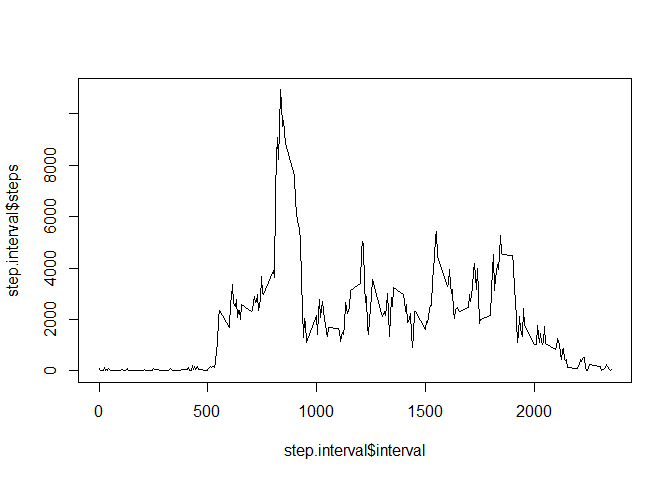
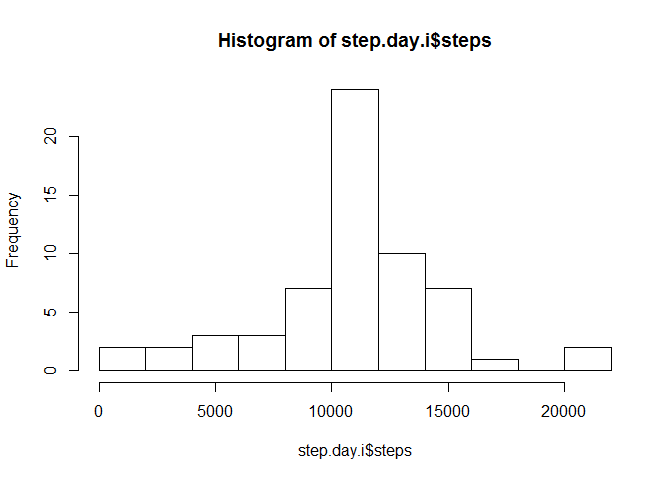
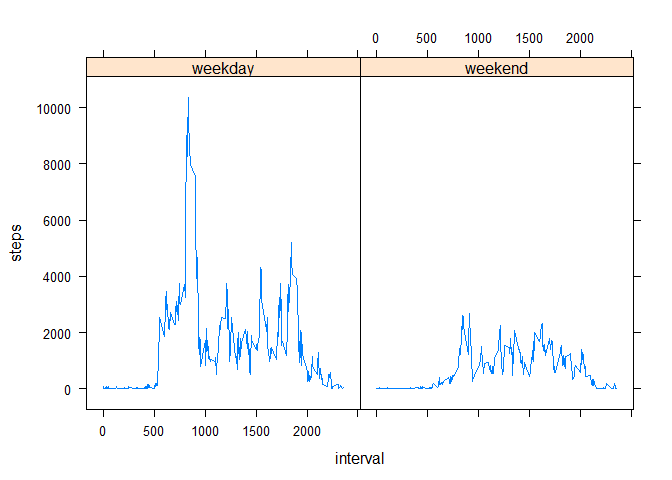

# Reproducible Research: Peer Assessment 1


## Loading and preprocessing the data

```r
#package loads
library(dplyr)
library(lattice)
```


```r
unzip("activity.zip") ##unzip gives activity.csv in our working directory
dat <- read.csv("activity.csv",stringsAsFactors=F)
```


## What is mean total number of steps taken per day?

```r
#use dplyr to group and summarize by each date value
step.day <- dat %>% group_by(date) %>% summarize(steps=sum(steps,na.rm=T))
hist(step.day$steps,breaks=10)
```

 

```r
mean(step.day$steps)
```

```
## [1] 9354.23
```

```r
median(step.day$steps)
```

```
## [1] 10395
```

## What is the average daily activity pattern?


```r
step.interval <- dat %>% group_by(interval) %>% summarize(steps=sum(steps,na.rm=T))
plot(step.interval$interval,step.interval$steps,type="l")
```

 

```r
#interval with the largest number of steps on average
arrange(step.interval,desc(steps))[[1,1]]
```

```
## [1] 835
```

## Imputing missing values


```r
#provides the number of rows that are not complete which we will be imputing.
dat.miss <- nrow(dat[!complete.cases(dat),])
dat.miss
```

```
## [1] 2304
```

```r
dat.impute <- dat #initialize new var

#calculate the mean step value across all days for each interval. 
sim <- dat.impute %>% group_by(interval) %>% summarize(steps=mean(steps,na.rm=T)) #sim= step.interval.mean

#set our NA values equal to our calculated mean unless our mean is NA in which we give the value of 0
for(i in 1:nrow(dat.impute)){
    if(is.na(dat.impute$steps[[i]])){
        step.mn <- as.double(sim[sim$interval==dat.impute$interval[[i]],2])
        if(is.na(step.mn)){
            dat.impute$steps[i] <- 0 #if the entire interval was missing then we call it 0 steps.
        }
        else {
            dat.impute$steps[i] <- step.mn
        }
    }
}

#use dplyr to group and summarize by each date value; same as before but for dat.impute. .i for imputed
step.day.i <- dat.impute %>% group_by(date) %>% summarize(steps=sum(steps,na.rm=T))
hist(step.day.i$steps,breaks=10)
```

 

```r
mean(step.day.i$steps)
```

```
## [1] 10766.19
```

```r
median(step.day.i$steps)
```

```
## [1] 10766.19
```

```r
#These values can be compared to the earlier mean and median duplicated below:
mean(step.day$steps)
```

```
## [1] 9354.23
```

```r
median(step.day$steps)
```

```
## [1] 10395
```

## Are there differences in activity patterns between weekdays and weekends?


```r
weekendCheck <- function(x){
    temp <- vector()
    for(i in 1:length(x)){
        if(weekdays(x[i])=="Sunday" | weekdays(x[i])=="Saturday"){
            temp[i] <- "weekend"
        }
        else {
            temp[i] <- "weekday"
        }
    }
    return(temp)
}
dat.impute$date <- as.POSIXct(dat.impute$date)

dat.impute$wknd <- factor(weekendCheck(dat.impute$date))

dat.graph <- dat.impute %>% group_by(interval,wknd) %>% summarize(steps=sum(steps,na.rm=T))
xyplot(steps~interval | factor(wknd),dat.graph,type="l",)
```

 

